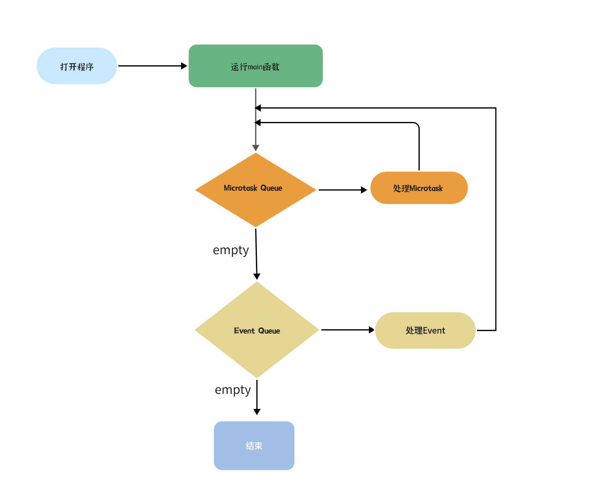

# Dart模块化详解

[linwu](https://www.coding-time.cn/)2023年7月9日大约 2 分钟

------

在大型软件项目中，模块化是必不可少的，它可以帮助我们更好地组织和管理代码，提高代码的可读性和可维护性。在Dart中，模块化是通过库（libraries）来实现的。

## [#](https://www.coding-time.cn/dart/advance/Dart模块化.html#库的定义与使用)库的定义与使用

> 这里简单做个介绍，下一章节会重点分析

Dart库是一种代码模块，它可以包含变量、函数、类和其他代码。一个库在其它库中通过`import`关键字导入后，库中的代码就可以被使用。

Dart语言自带了一些核心库，如 `dart:core`, `dart:io`, `dart:html`等。例如：

```dart
import 'dart:io';
```

你也可以导入自定义的库或者第三方库。如果库在包（package）中，可以通过以下方式导入：

```dart
import 'package:my_package/my_library.dart';
```

## [#](https://www.coding-time.cn/dart/advance/Dart模块化.html#创建自定义库)创建自定义库

你可以创建自己的Dart库，一个库就是一个Dart源文件。该文件可以包含一些函数和类的定义。例如，你可以创建一个文件`my_library.dart`：

```dart
// 定义一个函数
void myFunction() {
  print('Hello, Dart!');
}

// 定义一个类
class MyClass {
  void sayHello() {
    print('Hello from MyClass!');
  }
}
```

然后，在其他Dart文件中导入并使用这个库：

```dart
import 'my_library.dart';

void main() {
  myFunction();

  var myObject = MyClass();
  myObject.sayHello();
}
```

## [#](https://www.coding-time.cn/dart/advance/Dart模块化.html#导入库的一部分)导入库的一部分

有时，我们可能只需要使用库中的某一部分代码。这时，我们可以使用`show`关键字来只导入需要的部分：

```dart
import 'my_library.dart' show MyClass; // 只导入MyClass
```

反之，如果你只想排除库中的某些部分，可以使用`hide`关键字：

```dart
import 'my_library.dart' hide myFunction; // 导入my_library，但不包括myFunction
```

## [#](https://www.coding-time.cn/dart/advance/Dart模块化.html#延迟加载-lazy-loading)延迟加载（Lazy Loading）

Dart也支持延迟加载，也被称为懒加载，可以在需要时再加载和初始化模块。延迟加载可以提高应用的启动速度。你可以使用`deferred as`关键字来标记延迟加载的库：

```dart
import 'package:somepackage/somelibrary.dart' deferred as someLibrary;

void main() {
  someLibrary.loadLibrary().then((_) {
    someLibrary.someFunction();
  });
}
```

在上述代码中，`someLibrary`将在`loadLibrary()`函数调用后才会被加载。在库加载完成后，`someFunction()`才会被调用。

[在 GitHub 上编辑此页](https://github.com/linwu-hi/coding-time/edit/main/docs/dart/advance/Dart模块化.md)


# Dart库的使用和创建

[linwu](https://www.coding-time.cn/)2023年7月9日大约 3 分钟

------

## [#](https://www.coding-time.cn/dart/advance/Dart库的使用和创建.html#引言)引言

在Dart中，代码重用和模块化可以通过库（libraries）和包（packages）实现。一个库就是一组代码，被一起打包为了实现一种或多种特定功能。一个包则是一种发布和分享Dart库的方式。在这一章，我们将详细介绍如何使用和创建Dart库和包，以及如何实现一个具有大数相加功能的库。

## [#](https://www.coding-time.cn/dart/advance/Dart库的使用和创建.html#dart库的使用)Dart库的使用

### [#](https://www.coding-time.cn/dart/advance/Dart库的使用和创建.html#导入库)导入库

在Dart中，我们通过import关键字导入库。例如，要导入Dart的内置库dart:math，我们可以这样做：

```dart
import 'dart:math';
```

我们也可以导入我们自己定义的库，或者从pub.dev安装的库。例如，如果我们有一个名为'big_numbers.dart'的库，我们可以这样导入：

```dart
import 'package:my_app/big_numbers.dart';
```

### [#](https://www.coding-time.cn/dart/advance/Dart库的使用和创建.html#使用库中的函数和类)使用库中的函数和类

导入库之后，就可以使用库中定义的函数和类了。例如，dart:math库中有一个sqrt函数，我们可以这样使用它：

```dart
var squareRoot = sqrt(16);  // 输出：4.0
```

## [#](https://www.coding-time.cn/dart/advance/Dart库的使用和创建.html#dart库的创建)Dart库的创建

### [#](https://www.coding-time.cn/dart/advance/Dart库的使用和创建.html#创建库文件)创建库文件

我们首先需要创建一个新的.dart文件。这个文件就是我们的库文件。例如，我们可以创建一个名为'big_numbers.dart'的文件。

### [#](https://www.coding-time.cn/dart/advance/Dart库的使用和创建.html#定义库)定义库

在这个文件中，我们首先需要使用library关键字定义我们的库：

```dart
library big_numbers;
```

然后，我们可以在这个库中定义我们的函数和类。例如，我们可以定义一个用于大数相加的函数：

```dart
String addBigNumbers(String num1, String num2) {
  // 这里是函数的实现
}
```

### [#](https://www.coding-time.cn/dart/advance/Dart库的使用和创建.html#导出库)导出库

如果我们的库中有一些函数和类是希望被其他库使用的，我们需要使用export关键字导出它们：

```dart
export 'src/big_numbers.dart';
```

注意，只有导出的函数和类才能被其他库使用。

## [#](https://www.coding-time.cn/dart/advance/Dart库的使用和创建.html#实现一个大数相加的库)实现一个大数相加的库

在我们的'big_numbers.dart'库中，我们现在来实现一个大数相加的函数。我们首先需要了解一下大数相加的基本思想：

对于大数相加，我们不能直接使用普通的加法运算，因为数字太大可能会溢出。因此，我们需要将大数转换为字符串，然后按位进行相加。

> Dart语言提供了对大整数（BigInteger）的内置支持，即 BigInt 类。这种类型的整数可以是任意大小，只要你的计算机有足够的内存来存储它们,你可以直接使用加法运算符（+）来进行大整数的相加。

让我们来看看如何实现这个函数：

```dart
String addBigNumbers(String num1, String num2) {
  // 从最后一位（个位）开始相加
  int i = num1.length - 1;
  int j = num2.length - 1;

  int carry = 0; // 进位


  String result = '';

  // 从右到左，逐位相加
  while (i >= 0 || j >= 0) {
    int sum = carry;
    
    if (i >= 0) sum += num1[i--] - '0';
    if (j >= 0) sum += num2[j--] - '0';

    carry = sum ~/ 10; // 计算进位
    result = (sum % 10).toString() + result; // 计算当前位的值
  }

  // 如果最后还有进位，添加到结果的前面
  if (carry > 0) result = carry.toString() + result;

  return result;
}
```

## [#](https://www.coding-time.cn/dart/advance/Dart库的使用和创建.html#dart包的创建和发布)Dart包的创建和发布

我们已经创建了一个'big_numbers.dart'库，现在我们可以将它打包为一个Dart包，并发布到pub.dev。

### [#](https://www.coding-time.cn/dart/advance/Dart库的使用和创建.html#创建一个pubspec-yaml文件)创建一个pubspec.yaml文件

首先，我们需要创建一个pubspec.yaml文件，这个文件用于描述我们的包的信息，包括名称、版本、描述等等。

```yaml
name: big_numbers
description: A Dart library for adding big numbers.
version: 1.0.0

environment:
  sdk: '>=2.10.0 <3.0.0'

dependencies:
  flutter:
    sdk: flutter

dev_dependencies:
  flutter_test:
    sdk: flutter

flutter:
  uses-material-design: true
```

### [#](https://www.coding-time.cn/dart/advance/Dart库的使用和创建.html#发布包)发布包

然后，我们可以使用pub命令发布我们的包：

```bash
dart pub publish
```

注意，在发布包之前，我们需要确保我们已经注册了一个pub.dev的账号，并且在我们的计算机上配置了pub的认证信息。

[在 GitHub 上编辑此页](https://github.com/linwu-hi/coding-time/edit/main/docs/dart/advance/Dart库的使用和创建.md)


# Dart的命令行和Web编程

[linwu](https://www.coding-time.cn/)2023年7月9日大约 2 分钟

------

Dart是一个多平台的语言，它支持命令行编程和Web编程。下面是这两种编程方式的一些基础知识。

## [#](https://www.coding-time.cn/dart/advance/Dart的命令行和Web编程.html#dart的命令行编程)Dart的命令行编程

在命令行编程中，我们主要使用`dart:io`库，这个库提供了一些与文件系统交互、网络编程、进程管理等功能的类和函数。

### [#](https://www.coding-time.cn/dart/advance/Dart的命令行和Web编程.html#读取和写入文件)读取和写入文件

下面是一个例子，演示如何在Dart中读取和写入文件：

```dart
import 'dart:io';

void main() async {
  var file = File('test.txt');

  // 写入文件
  await file.writeAsString('Hello, Dart!');

  // 读取文件
  var contents = await file.readAsString();
  print(contents);  // 输出：Hello, Dart!
}
```

### [#](https://www.coding-time.cn/dart/advance/Dart的命令行和Web编程.html#网络编程)网络编程

`dart:io`库还提供了一些类来进行HTTP和WebSocket编程。下面是一个简单的HTTP客户端的例子：

```dart
import 'dart:io';

void main() async {
  var url = Uri.parse('https://dart.dev');
  var client = HttpClient();

  var request = await client.getUrl(url);
  var response = await request.close();

  await for (var data in response.transform(Utf8Decoder())) {
    print(data);
  }
}
```

## [#](https://www.coding-time.cn/dart/advance/Dart的命令行和Web编程.html#dart的web编程)Dart的Web编程

Dart也可以用于构建高质量的Web应用。在Web编程中，我们通常使用`dart:html`库，这个库提供了一些与DOM交互、处理事件、创建HTML元素等功能的类和函数。

### [#](https://www.coding-time.cn/dart/advance/Dart的命令行和Web编程.html#操作dom)操作DOM

下面是一个例子，演示如何在Dart中操作DOM：

```dart
import 'dart:html';

void main() {
  // 获取一个元素
  var title = querySelector('#title');

  // 修改元素的内容
  title.text = 'Hello, Dart!';
}

// HTML文件：
// <h1 id="title">Welcome to Dart</h1>
```

### [#](https://www.coding-time.cn/dart/advance/Dart的命令行和Web编程.html#处理事件)处理事件

我们还可以在Dart中处理各种用户事件，例如点击事件：

```dart
import 'dart:html';

void main() {
  var button = querySelector('#button');

  button.onClick.listen((event) {
    print('Button clicked!');
  });
}

// HTML文件：
// <button id="button">Click me</button>
```

## [#](https://www.coding-time.cn/dart/advance/Dart的命令行和Web编程.html#dart编译成javascript)Dart编译成JavaScript

Dart语言可以被编译成JavaScript，这使得Dart能在所有的现代浏览器中运行，无论是桌面浏览器还是移动设备浏览器。Dart提供了`dart2js`和`dartdevc`两种编译工具，分别用于生产环境和开发环境。

### [#](https://www.coding-time.cn/dart/advance/Dart的命令行和Web编程.html#dart2js)dart2js

`dart2js`是一个强大的工具，它可以将Dart代码编译成高效的、压缩的、部署就绪的JavaScript代码。通常我们在准备部署我们的Dart web应用到生产环境时使用`dart2js`。

下面是一个使用`dart2js`的例子：

```bash
dart2js -O2 -o main.dart.js main.dart
```

这个命令会将`main.dart`编译成`main.dart.js`，并且使用了`-O2`优化选项。

### [#](https://www.coding-time.cn/dart/advance/Dart的命令行和Web编程.html#dartdevc)dartdevc

`dartdevc`（Dart Development Compiler）是另一个Dart到JavaScript的编译器，主要用于开发环境。相比于`dart2js`，`dartdevc`生成的JavaScript代码更易于调试，但是不如`dart2js`生成的代码运行效率高。

在开发环境中，我们通常使用`webdev serve`命令来运行我们的Dart web应用，这个命令会自动使用`dartdevc`来编译我们的代码：

```bash
webdev serve
```

然后你就可以在浏览器中打开你的应用，地址通常是`localhost:8080`。

[在 GitHub 上编辑此页open in new window](https://github.com/linwu-hi/coding-time/edit/main/docs/dart/advance/Dart的命令行和Web编程.md)


# Dart中使用JSON

[linwu](https://www.coding-time.cn/)2023年7月9日大约 4 分钟

------

# [#](https://www.coding-time.cn/dart/advance/Dart中使用JSON.html#第九章-dart中使用json)第九章：Dart中使用JSON

JSON (JavaScript Object Notation) 是一种轻量级的数据交换格式，它基于JavaScript的一个子集。在Dart中，你可以使用`dart:convert`库来进行JSON的编码和解码。

## [#](https://www.coding-time.cn/dart/advance/Dart中使用JSON.html#_9-1-json编码)9.1 JSON编码

你可以使用`jsonEncode`函数将一个`Dart对象`转换为JSON字符串。例如：

```dart
import 'dart:convert';

void main() {
  var person = {
    'name': 'John Doe',
    'age': 30,
    'city': 'New York'
  };

  var json = jsonEncode(person);
  print(json);  // 输出：{"name":"John Doe","age":30,"city":"New York"}
}
```

如果你需要将一个`Dart类`转换为JSON字符串，那么你需要在对象中添加一个`toJson`方法，这个方法应该返回一个可以直接转换为JSON字符串的对象。例如：

```dart
import 'dart:convert';

class Person {
  String name;
  int age;
  String city;

  Person(this.name, this.age, this.city);

  Map<String, dynamic> toJson() => {
        'name': name,
        'age': age,
        'city': city,
      };
}

void main() {
  var person = Person('John Doe', 30, 'New York');
  var json = jsonEncode(person);
  print(json);  // 输出：{"name":"John Doe","age":30,"city":"New York"}
}
```

## [#](https://www.coding-time.cn/dart/advance/Dart中使用JSON.html#_9-2-json解码)9.2 JSON解码

你可以使用`jsonDecode`函数将一个JSON字符串转换为Dart对象。例如：

```dart
import 'dart:convert';

void main() {
  var json = '{"name":"John Doe","age":30,"city":"New York"}';
  var person = jsonDecode(json);
  print(person);  // 输出：{name: John Doe, age: 30, city: New York}
}
```

如果你需要将一个JSON字符串转换为`Dart类`，那么你需要在对象中添加一个命名构造函数，例如`fromJson`，这个构造函数应该接收一个`Map<String, dynamic>`类型的参数。例如：

```dart
import 'dart:convert';

class Person {
  String name;
  int age;
  String city;

  Person(this.name, this.age, this.city);

  Person.fromJson(Map<String, dynamic> json)
      : name = json['name'],
        age = json['age'],
        city = json['city'];
}

void main() {
  var json = '{"name":"John Doe","age":30,"city":"New York"}';
  var person = Person.fromJson(jsonDecode(json));
  print(person.name);  // 输出：John Doe
}
```

## [#](https://www.coding-time.cn/dart/advance/Dart中使用JSON.html#使用json-serializable)使用json_serializable

在上一部分中，我们介绍了如何手动将JSON转换为Dart对象。然而，当你处理复杂的JSON数据时，手动转换可能会变得繁琐并且容易出错。因此，你可能会想使用代码生成库来自动完成这部分工作。在Dart中，有一种非常流行的库就是`json_serializable`。

要使用`json_serializable`，你首先需要在`pubspec.yaml`文件中添加相关的依赖：

```yaml
dependencies:
  flutter:
    sdk: flutter
  json_annotation: ^4.0.0

dev_dependencies:
  flutter_test:
    sdk: flutter
  build_runner: ^2.0.0
  json_serializable: ^4.0.0
```

然后运行`flutter pub get`命令来安装这些包。

接下来，你需要定义你的模型类，并使用一些注解：

```dart
import 'package:json_annotation/json_annotation.dart';

part 'person.g.dart';

@JsonSerializable()
class Person {
  String name;
  int age;
  String city;

  Person(this.name, this.age, this.city);

  factory Person.fromJson(Map<String, dynamic> json) => _$PersonFromJson(json);

  Map<String, dynamic> toJson() => _$PersonToJson(this);
}
```

在这个例子中，`_$PersonFromJson`和`_$PersonToJson`是由`json_serializable`生成的辅助函数，它们将会在我们运行代码生成命令后自动生成。

现在，你可以运行以下命令来生成JSON序列化代码：

```bash
flutter pub run build_runner build
```

生成的代码将会放在一个名为`person.g.dart`的文件中。

现在，你就可以使用`fromJson`和`toJson`方法来进行JSON和模型的转换了：

```dart
void main() {
  var json = '{"name":"John Doe","age":30,"city":"New York"}';
  
  var person = Person.fromJson(jsonDecode(json));
  print(person.name);  // 输出：John Doe
  
  var json = jsonEncode(person.toJson());
  print(json);  // 输出：{"name":"John Doe","age":30,"city":"New York"}
}
```

`json_serializable`提供了许多其他的功能，例如处理嵌套的模型、使用自定义的日期格式、处理枚举类型等。要了解更多信息，你可以查看其官方文档。

## [#](https://www.coding-time.cn/dart/advance/Dart中使用JSON.html#实践)实践

> 实际开发中，我们会将接口拿到的JSON数据转化为Dart 类 (通常被称为模型或数据类)

主要有以下原因：

1. **类型安全**：Dart 是一种强类型语言，这意味着当你定义了一个变量的类型，你就不能再将其他类型的值赋给这个变量。通过将 JSON 数据转换为 Dart 类，你可以获得编译时的类型检查，这可以帮助你找出可能的错误。例如，如果你尝试将一个字符串赋给一个整数类型的字段，编译器会给出错误。
2. **代码可读性和可维护性**：将 JSON 数据转换为 Dart 类可以使你的代码更加清晰和易于理解。你可以明确地知道你的数据结构，而不是在一个大的、结构不清的 Map 中查找数据。
3. **易于操作**：使用 Dart 类来处理 JSON 数据，你可以使用 Dart 的各种特性，例如方法、计算属性等。此外，许多 Dart 库和框架，例如 Flutter，需要使用 Dart 类来工作。
4. **自动补全和文档**：在 Dart 类中，你可以使用文档注释来说明每个字段的用途。而在 IDE 中，当你输入一个对象和一个点 (.) 时，IDE 就会显示出所有可用的字段和方法，这可以提高开发效率。

[在 GitHub 上编辑此页](https://github.com/linwu-hi/coding-time/edit/main/docs/dart/advance/Dart中使用JSON.md)


# Dart的异步编程

[linwu](https://www.coding-time.cn/)2023年7月9日大约 2 分钟

------

在 Dart 中，我们使用 `Future` 和 `async`/`await` 来进行异步编程。当你调用一个异步函数时，它将立即返回一个 `Future` 对象。当异步操作完成时，`Future` 将被“完成”或“解析”。

## [#](https://www.coding-time.cn/dart/advance/Dart的异步编程.html#使用-future)使用 Future

Future 是 Dart 中用于表示异步操作的对象。当你调用一个异步函数时，它会立即返回一个 Future 对象，表示这个异步操作的结果。

Future 对象有三种状态：

未完成：异步操作还没有完成。 完成（resolved）：异步操作成功完成，并返回一个值。 错误（rejected）：异步操作失败，并返回一个错误。

> 如果你了解Javascript中的Promise，那么就能非常简单掌握Future了

一个简单的 `Future` 示例如下：

```dart
Future<String> fetchUserOrder() {
  // 模拟网络延迟
  return Future.delayed(Duration(seconds: 2), () => 'Large Latte');
}

void main() {
  print('Fetching user order...');
  fetchUserOrder()
      .then((order) => print('Your order is: $order'))
      .catchError((error) => print(error));
}
```

在这个示例中，`fetchUserOrder` 是一个异步函数，它使用 `Future.delayed` 来模拟网络延迟。当调用 `fetchUserOrder` 时，它立即返回一个 `Future<String>` 对象。然后我们使用 `then` 和 `catchError` 来处理 `Future` 的成功和错误结果。

## [#](https://www.coding-time.cn/dart/advance/Dart的异步编程.html#使用-async-await)使用 async/await

你也可以使用 `async`/`await` 关键字来更简洁地处理异步操作。一个使用 `async`/`await` 的示例如下：

```dart
Future<String> fetchUserOrder() {
  return Future.delayed(Duration(seconds: 2), () => 'Large Latte');
}

Future<void> main() async {
  print('Fetching user order...');
  try {
    var order = await fetchUserOrder();
    print('Your order is: $order');
  } catch (error) {
    print(error);
  }
}
```

在这个示例中，我们使用 `async` 关键字来标记 `main` 函数是一个异步函数。然后我们使用 `await` 关键字来等待 `fetchUserOrder` 的结果。如果 `fetchUserOrder` 抛出一个错误，我们可以使用 `try`/`catch` 来处理这个错误。

需要注意的是，你只能在 `async` 函数中使用 `await` 关键字。

[在 GitHub 上编辑此页](https://github.com/linwu-hi/coding-time/edit/main/docs/dart/advance/Dart的异步编程.md)


# 事件循环和协程机制

[linwu](https://www.coding-time.cn/)2023年7月9日大约 9 分钟

------

> Dart实现异步的方式同Javascript类似，如果你掌握Javascript的事件循环机制，那么学习Dart的异步机制就非常简单了

在 Dart 中，事件循环和协程是实现异步编程的核心机制。它们使得我们能够以非阻塞的方式处理异步操作，并允许在异步操作期间暂停和继续执行代码。本文将深入探讨 Dart 的事件循环和协程机制，并结合代码示例进行详细说明。

## [#](https://www.coding-time.cn/dart/advance/事件循环和协程机制.html#协程-coroutine)协程（Coroutine）

协程是一种轻量级的线程，它可以在程序内部进行切换，而不需要依赖操作系统的线程管理。在 Dart 中，协程的实现是通过异步函数和 await 关键字来实现的。

异步函数使用 async 关键字来标记，表示这个函数可能包含异步操作。在异步函数中，使用 await 关键字来等待一个 Future 的结果。当遇到 await 表达式时，当前协程会暂停执行，并将控制权交给事件循环，直到 Future 完成并返回结果。

```dart
void main() async {
  print('Start');

  // 异步函数中使用 await 等待 Future 的结果
  var result = await fetchData();
  print('Async result: $result');

  print('End');
}

Future<String> fetchData() {
  return Future.delayed(Duration(seconds: 2), () => 'Data loaded');
}
```

当涉及到 Dart 的事件循环时，可以结合事件队列、宏任务、微任务和协程的概念来完善整体的事件循环。下面是对事件循环的完善描述：

## [#](https://www.coding-time.cn/dart/advance/事件循环和协程机制.html#事件循环-event-loop)事件循环（Event Loop）

Dart 的事件循环是一个基于事件驱动的循环机制，用于处理异步操作和事件处理。它包括以下组件：事件队列、宏任务队列、微任务队列、IO 事件处理器和异步任务处理器等。

事件循环的完整流程如下：

1.初始化事件循环，并创建事件队列、宏任务队列和微任务队列。 2. 事件循环从事件队列中取出一个事件。 3. 如果是微任务（如 Future.then() 回调函数），将微任务添加到微任务队列中。 4. 如果是宏任务（如定时器事件、IO 事件、用户交互事件等），将宏任务添加到宏任务队列中。 5. 事件循环首先处理微任务队列中的所有微任务，确保微任务在当前事件循环中优先执行。 6. 微任务队列中的所有微任务都处理完毕后，事件循环开始处理宏任务队列中的宏任务。 7. 事件循环处理宏任务，执行相应的回调函数，并等待宏任务完成。 8. 宏任务处理完成后，事件循环回到步骤2，继续处理下一个事件,事件循环在整个过程中不断循环，直到事件队列为空或程序终止

事件循环流程图

通过微任务队列的处理机制，Dart 确保了在事件循环的每一轮中，微任务能够优先得到处理。这保证了微任务的及时执行，并避免了某些异步任务被延迟处理的情况。

通过协程的机制，Dart 实现了非阻塞的异步编程。当遇到 await 表达式时，协程会暂停执行，并将控制权交给事件循环。一旦 Future 完成并返回结果，协程恢复执行，并继续执行 await 表达式之后的代码。

```dart
void main() {
  print('Start');

  // 添加一个定时器事件
  Timer(Duration(seconds: 2), () {
    print('Timer event');
  });

  // 添加一个 IO 事件
  File('data.txt').readAsString().then((data) {
    print('IO event: $data');
  });

  // 添加一个异步任务
  fetchData().then((result) {
    print('Async event: $result');
  });

  print('End');
}

Future<String> fetchData() {
  return Future.delayed(Duration(seconds: 1), () => 'Data loaded');
}
```

在上面的示例中，我们向事件队列中添加了一个定时器事件、一个 IO 事件和一个异步任务。在事件循环的处理过程中，定时器事件会在指定的延迟时间后触发，IO 事件会在文件读取完成后执行回调函数，异步任务会在 Future 完成后传递结果。

## [#](https://www.coding-time.cn/dart/advance/事件循环和协程机制.html#协程-coroutine-1)协程（Coroutine）

协程是一种轻量级的线程，它可以在程序内部进行切换，而不需要依赖操作系统的线程管理。在 Dart 中，协程的实现是通过异步函数和 await 关键字来实现的。

异步函数使用 async 关键字来标记，表示这个函数可能包含异步操作。在异步函数中，使用 await 关键字来等待一个 Future 的结果。当遇到 await 表达式时，当前

协程会暂停执行，并将控制权交给事件循环，直到 Future 完成并返回结果。

下面是一个示例代码，展示了协程的工作流程：

```dart
void main() async {
  print('Start');

  // 异步函数中使用 await 等待 Future 的结果
  var result = await fetchData();
  print('Async result: $result');

  print('End');
}

Future<String> fetchData() {
  return Future.delayed(Duration(seconds: 2), () => 'Data loaded');
}
```

在上面的示例中，main() 函数被标记为异步函数，使用 async 关键字进行标记。在异步函数中，我们使用 await 关键字等待 fetchData() 函数的结果。在等待期间，协程会暂停执行，并将控制权返回给事件循环。一旦 Future 完成并返回结果，协程恢复执行，并打印出结果。

## [#](https://www.coding-time.cn/dart/advance/事件循环和协程机制.html#宏任务队列-macrotask-queue)宏任务队列（Macrotask Queue））

在 Dart 中，宏任务（Macrotask）是指需要在事件循环的下一轮执行的任务。与微任务不同，宏任务的执行发生在微任务队列处理完毕后。以下是一些常见的宏任务：

### [#](https://www.coding-time.cn/dart/advance/事件循环和协程机制.html#_1-定时器事件)1. 定时器事件

通过 Timer 类创建的定时器事件是宏任务。可以使用 Timer 类的方法（如 Timer.run()、Timer.periodic()、Timer(Duration, callback)）来创建定时器事件，并在指定的延迟时间后执行回调函数。

```dart
void main() {
  print('Start');

  Timer(Duration(seconds: 2), () {
    print('Timer event');
  });

  print('End');
}
```

在上面的示例中，通过 Timer 类创建的定时器事件会在指定的延迟时间后作为宏任务执行。

### [#](https://www.coding-time.cn/dart/advance/事件循环和协程机制.html#_2-io-事件)2. IO 事件

包括文件读写、网络请求等异步操作。当执行这些异步操作时，相应的 IO 事件会被触发，然后作为宏任务在事件循环的下一轮执行。

```dart
import 'dart:io';

void main() {
  print('Start');

  File('data.txt').readAsString().then((data) {
    print('IO event: $data');
  });

  print('End');
}
```

在上面的示例中，文件读取的 IO 事件会在文件读取完成后作为宏任务执行。

### [#](https://www.coding-time.cn/dart/advance/事件循环和协程机制.html#_3-ui-事件)3. UI 事件

在 Flutter 应用程序中，用户交互（如点击按钮、滑动屏幕等）触发的事件也是宏任务。这些 UI 事件会被放入事件队列，并在事件循环的下一轮执行。

```dart
import 'package:flutter/material.dart';

void main() {
  runApp(MyApp());
}

class MyApp extends StatelessWidget {
  @override
  Widget build(BuildContext context) {
    return MaterialApp(
      home: Scaffold(
        appBar: AppBar(
          title: Text('Macrotask Example'),
        ),
        body: Center(
          child: RaisedButton(
            child: Text('Click Me'),
            onPressed: () {
              print('Button clicked');
            },
          ),
        ),
      ),
    );
  }
}
```

在上面的示例中，按钮点击事件会在事件循环的下一轮作为宏任务执行。

宏任务与微任务相对，宏任务的执行顺序在微任务之后。`在事件循环的每一轮中，首先会处理微任务队列中的所有微任务，然后才会执行宏任务。`

通过宏任务，我们可以在 Dart 中处理一些需要在下一轮事件循环执行的任务，例如定时器事件、IO 事件和用户交互事件。这使得我们可以在合适的时机执行这些任务，并保持事件循环的稳定性和性能。

## [#](https://www.coding-time.cn/dart/advance/事件循环和协程机制.html#微任务队列-microtask-queue)微任务队列（Microtask Queue）

Dart 中的微任务队列用于处理异步任务的回调函数。它保证异步任务的回调函数能够及时执行。常见的微任务包括 Future.then()、async/await 的回调等。

下面是一个示例代码，演示了微任务队列的处理过程：

```dart
void main() {
  print('Start');

  Future.microtask(() => print('Microtask 1'));

  Future.delayed(Duration(seconds: 1), () {
    print('Async event');
  });

  Future.microtask(() => print('Microtask 2'));

  print('End');
}
```

在上面的示例中，我们使用 Future.microtask() 方法将两个微任务添加到微任务队列中。这些微任务会在当前事件循环中的其他事件之后立即执行，而不会等待其他事件的完成。因此，"Microtask 1" 和 "Microtask 2" 的输出会在 "Async event" 之前打印出来。

综上所述，Dart 的事件循环、协程和微任务队列相互配合，实现了高效的异步编程机制。事件循环负责处理各种事件，协程允许代码在异步操作期间暂停和继续执行，微任务队列保证异步任务的回调函数能够及时执行。这些机制的结合使得 Dart 能够实现高性能和灵活的异步编程。

## [#](https://www.coding-time.cn/dart/advance/事件循环和协程机制.html#微任务队列-microtask-queue-1)微任务队列（Microtask Queue）

Dart 中的微任务队列用于处理异步任务的回调函数。它保证异步任务的回调函数能够及时执行。常见的微任务包括 Future.then()、async/await 的回调等。

```dart
void main() {
  print('Start');

  Future.microtask(() => print('Microtask 1'));

  Future.delayed(Duration(seconds: 1), () {
    print('Async event');
  });

  Future.microtask(() => print('Microtask 2'));

  print('End');
}
```

### [#](https://www.coding-time.cn/dart/advance/事件循环和协程机制.html#常见的微任务)常见的微任务

#### [#](https://www.coding-time.cn/dart/advance/事件循环和协程机制.html#_1-future-then-回调)1. Future.then() 回调

当一个 Future 完成时，可以使用 Future.then() 方法添加回调函数。这些回调函数会被添加到微任务队列中，并在当前事件循环中的微任务阶段执行。

```dart
Future.delayed(Duration(seconds: 1)).then((value) {
  print('Future.then() callback');
});
```

#### [#](https://www.coding-time.cn/dart/advance/事件循环和协程机制.html#_2-async-await-的回调)2. async/await 的回调

使用 async/await 语法编写的异步函数中，await 表达式会等待一个 Future 的完成，并在当前事件循环中的微任务阶段恢复执行。

```dart
void main() async {
  print('Start');
  await Future.delayed(Duration(seconds: 1));
  print('Async callback');
}
```

#### [#](https://www.coding-time.cn/dart/advance/事件循环和协程机制.html#_3-schedulemicrotask-函数)3. scheduleMicrotask() 函数

可以使用 scheduleMicrotask() 函数将一个回调函数添加到微任务队列中，以确保它在当前事件循环的微任务阶段执行。

```dart
void main() {
  print('Start');
  scheduleMicrotask(() {
    print('Microtask callback');
  });
}
```

这些微任务都会在当前事件循环的微任务阶段被执行，而不会被其他事件中断。微任务的执行顺序是按照它们被添加到微任务队列的顺序来执行的。

请注意，与微任务相对的是宏任务（例如定时器事件、IO 事件等），宏任务的执行会在微任务之后进行。因此，在事件循环的每一轮中，`微任务先于宏任务执行`。

[在 GitHub 上编辑此页](https://github.com/linwu-hi/coding-time/edit/main/docs/dart/advance/事件循环和协程机制.md)


# Dart的Stream

[linwu](https://www.coding-time.cn/)2023年7月9日大约 4 分钟

------

Stream 是 Dart 中处理连续的异步事件的工具。例如，你可以使用 Stream 来读取文件的内容，或者监听用户的鼠标点击。

一个简单的 Stream 示例：

```dart
Future<void> main() async {
  var stream = Stream.fromIterable([1, 2, 3, 4, 5]);

  await for (var number in stream) {
    print(number);  // 输出：1, 2, 3, 4, 5
  }
}
```

在这个示例中，我们使用 `Stream.fromIterable` 创建了一个 Stream，它将连续地产生 1 到 5 这五个数字。然后我们使用 `await for` 循环来监听 Stream 的事件。

如果你需要在监听 Stream 的过程中处理错误，你可以使用 `try`/`catch`：

```dart
Future<void> main() async {
  var stream = Stream<int>.periodic(
    Duration(seconds: 1),
    (x) {
      if (x == 3) {
        throw Exception('Error!');
      } else {
        return x;
      }
    },
  ).take(5);

  try {
    await for (var number in stream) {
      print(number);
    }
  } catch (error) {
    print(error);
  }
}
```

## [#](https://www.coding-time.cn/dart/advance/Dart的Stream.html#创建-stream)创建 Stream

在 Dart 中，你可以使用多种方式来创建 Stream。前面我们已经见到了 `Stream.fromIterable`，下面是一些其他的方法：

- `Stream.empty`：创建一个不产生任何事件的 Stream。
- `Stream.error`：创建一个只产生一个错误事件的 Stream。
- `Stream.periodic`：创建一个周期性地产生事件的 Stream。
- `StreamController`：手动控制 Stream 的事件和错误。

例如，我们可以使用 `StreamController` 创建一个 Stream，并手动控制其事件和错误：

```dart
void main() async {
  var controller = StreamController<int>();

  controller.sink.add(1);
  controller.sink.add(2);
  controller.sink.addError('Oops!');
  controller.sink.add(3);
  controller.close();

  await for (var event in controller.stream) {
    print(event);
  }
}
```

在这个示例中，我们首先创建了一个 `StreamController`。然后我们使用 `sink.add` 方法添加了三个事件，使用 `sink.addError` 方法添加了一个错误。最后我们使用 `controller.close` 方法表示我们不会再添加任何事件或错误。

## [#](https://www.coding-time.cn/dart/advance/Dart的Stream.html#处理-stream-事件)处理 Stream 事件

我们可以使用 `Stream.listen` 方法监听 Stream 的事件：

```dart
void main() {
  var stream = Stream.fromIterable([1, 2, 3, 4, 5]);

  stream.listen(
    (event) {
      print('Received event: $event');
    },
    onError: (error) {
      print('Received error: $error');
    },
    onDone: () {
      print('All done');
    },
  );
}
```

在这个示例中，我们监听了 Stream 的数据事件、错误事件和完成事件。

## [#](https://www.coding-time.cn/dart/advance/Dart的Stream.html#转换-stream)转换 Stream

Stream API 提供了许多方法来转换 Stream。例如，你可以使用 `map` 方法来处理每个数据事件，或者使用 `where` 方法来过滤数据事件：

```dart
void main() async {
  var stream = Stream.fromIterable([1, 2, 3, 4, 5]);

  var evenStream = stream.where((event) => event % 2 == 0).map((event) => event * 2);

  await for (var event in evenStream) {
    print(event);  // 输出：4, 8
  }
}
```

在这个示例中，我们首先使用 `where` 方法创建了一个只包含偶数的 Stream，然后我们使用 `map` 方法将每个偶数乘以 2。

## [#](https://www.coding-time.cn/dart/advance/Dart的Stream.html#组合-stream)组合 Stream

你还可以使用 `StreamZip` 或 `StreamGroup` 来组合多个 Stream。例如，你可以使用 `StreamZip` 来同步处理两个 Stream 的数据事件：

```dart
void main() async {
  var stream1 = Stream.periodic(Duration(seconds: 1), (x) => x).take(5);
  var stream2 = Stream.periodic(Duration(seconds: 2), (x) => x).take(3);

  var zippedStream = StreamZip([stream1, stream2]);

  await for (var event in zippedStream) {
    print(event);  // 输出：[0, 0], [1, 1], [2, 2]
  }
}
```

## [#](https://www.coding-time.cn/dart/advance/Dart的Stream.html#stream的应用场景)Stream的应用场景

好的，让我详细地解释一下上述的几个应用场景，并提供一些具体的代码示例：

### [#](https://www.coding-time.cn/dart/advance/Dart的Stream.html#用户界面交互)用户界面交互

在 Flutter 等 Dart 构建的应用程序中，Stream 可以用来监听并响应用户的交互行为。例如，你可以创建一个自定义的 `StreamController`，并使用它来监听按钮点击事件：

```dart
// 创建一个 StreamController
StreamController controller = StreamController();

void main() {
  // 按钮点击事件监听
  controller.stream.listen((data) {
    print("Button clicked: $data");
  });

  // 模拟按钮点击
  controller.sink.add('Button 1');
}

// 在你的 UI 中，当按钮被点击时，你可以调用 controller.sink.add 来发送一个事件。
```

### [#](https://www.coding-time.cn/dart/advance/Dart的Stream.html#网络请求)网络请求

在进行网络请求时，服务器的响应通常会分成多个数据包。你可以使用 Stream 来连续地接收和处理这些数据包，这样你就可以在不等待整个响应完成的情况下开始处理数据：

```dart
import 'dart:convert';
import 'dart:io';

void main() async {
  var client = HttpClient();

  client.getUrl(Uri.parse('https://api.github.com/users/dart-lang/repos'))
    .then((HttpClientRequest request) {
      return request.close();
    })
    .then((HttpClientResponse response) {
      response.transform(Utf8Decoder()).listen((contents) {
        print(contents);
      });
    });
}
```

### [#](https://www.coding-time.cn/dart/advance/Dart的Stream.html#文件操作)文件操作

当你需要读取一个大文件时，可以使用 Stream 来逐行处理文件内容，这样你可以在不需要将整个文件加载到内存的情况下开始处理数据：

```dart
import 'dart:convert';
import 'dart:io';

void main() {
  File file = new File('path_to_your_file');
  Stream<List<int>> inputStream = file.openRead();

  inputStream
    .transform(utf8.decoder)       // Decode bytes to UTF-8.
    .transform(new LineSplitter()) // Convert stream to individual lines.
    .listen((String line) {        // Process results.
        print('$line: ${line.length} bytes');
    },
    onDone: () { print('File is now closed.'); },
    onError: (e) { print(e.toString()); });
}
```

### [#](https://www.coding-time.cn/dart/advance/Dart的Stream.html#定时任务)定时任务

你可以使用 Stream 创建一个定时任务，然后在每个时间间隔中执行一些操作。例如，下面的代码使用 `Stream.periodic` 创建了一个每秒执行一次的定时任务：

```dart
void main() {
  // 创建一个每秒触发一次的 Stream
  Stream.periodic(Duration(seconds: 1), (count) => count).listen((count) {
    print('Tick: $count');
  });
}
```

## [#](https://www.coding-time.cn/dart/advance/Dart的Stream.html#_5-数据流处理)5. 数据流处理

在处理大量数据流时，你可以使用 Stream 创建一个数据管道，并利用其提供的 `map`、`filter`、`reduce` 等操作进行数据处理。

```dart
void main() {
  Stream.fromIterable([1, 2, 3, 4, 5])
    .map((value)

 => value * 2)
    .listen((value) {
      print(value); // 输出 2, 4, 6, 8, 10
    });
}
```

这些示例展示了如何在不同的场景中使用 Stream。一旦你熟悉了 Stream 的工作方式，你会发现它是一个非常强大的工具，能够让你更方便地处理异步事件。

[在 GitHub 上编辑此页](https://github.com/linwu-hi/coding-time/edit/main/docs/dart/advance/Dart的Stream.md)


# Dart的Isolate

[linwu](https://www.coding-time.cn/)2023年7月9日大约 4 分钟

------

Isolate 是 Dart 中进行并发编程的一种方式。由于 Dart 是单线程模型，因此在需要处理 CPU 密集型任务或需要执行长时间运行的操作时，可以使用 Isolate。

## [#](https://www.coding-time.cn/dart/advance/Dart的Isolate.html#创建-isolate)创建 Isolate

在 Dart 中，所有的代码都运行在一个单线程中，这个线程被称为主 Isolate。如果你需要执行耗时的计算，你可以创建一个新的 Isolate，然后在这个新的 Isolate 中执行你的计算。

```dart
import 'dart:isolate';

void printMessage(var message) {
  print('Message: $message');
}

void main() async {
  var receivePort = ReceivePort();
  await Isolate.spawn(printMessage, 'Hello!', onExit: receivePort.sendPort);
  await for (var message in receivePort) {
    print('Received: $message');
  }
}
```

在这个示例中，我们使用 `Isolate.spawn` 创建了一个新的 Isolate。我们传递了一个函数 `printMessage` 和一个消息 `'Hello!'` 给这个新的 Isolate。当这个新的 Isolate 完成后，它将使用 `onExit` 参数指定的 `SendPort` 发送一个消息。

需要注意的是，不同的 Isolate 之间不能共享内存，它们只能通过消息传递来进行通信。因此，你不能在一个 Isolate 中访问另一个 Isolate 的变量。

## [#](https://www.coding-time.cn/dart/advance/Dart的Isolate.html#消息传递)消息传递

在 Dart 中，Isolate 之间的消息传递是通过 `SendPort` 和 `ReceivePort` 来实现的。

### [#](https://www.coding-time.cn/dart/advance/Dart的Isolate.html#sendport和receiveport)SendPort和ReceivePort

`SendPort` 和 `ReceivePort` 是 Dart 中进行进程间通信的工具。你可以将 `SendPort` 看作是一个邮箱的地址，`ReceivePort` 看作是一个邮箱。你可以通过 `SendPort` 发送消息，然后在对应的 `ReceivePort` 中接收消息。

当你创建一个 `ReceivePort` 时，它将自动生成一个与之关联的 `SendPort`：

```dart
var receivePort = ReceivePort();
var sendPort = receivePort.sendPort;
```

你可以使用 `sendPort.send` 方法发送消息，然后在 `receivePort` 中监听消息：

```dart
sendPort.send('Hello!');

receivePort.listen((message) {
  print('Received: $message');
});
```

## [#](https://www.coding-time.cn/dart/advance/Dart的Isolate.html#在isolate-之间传递消息)在Isolate 之间传递消息

当你创建一个新的 Isolate 时，你可以将一个 `SendPort` 传递给这个新的 Isolate。然后你就可以通过这个 `SendPort` 向新的 Isolate 发送消息，或者从新的 Isolate 接收消息。

```dart
void printMessage(var message) {
  var sendPort = message[0] as SendPort;
  var message = message[1] as String;
  
  print('Message: $message');

  sendPort.send('Hello from new Isolate!');
}

void main() async {
  var receivePort = ReceivePort();
  await Isolate.spawn(printMessage, [receivePort.sendPort, 'Hello!']);

  receivePort.listen((message) {
    print('Received: $message');
  });
}
```

在这个示例中，我们向新的 Isolate 发送了一个列表。这个列表的第一个元素是一个 `SendPort`，第二个元素是一个字符串。在新的 Isolate 中，我们首先通过 `SendPort` 发送了一个消息，然后打印了接收到的字符串。在主 Isolate 中，我们监听了 `ReceivePort`，然后打印了接收到的消息。

需要注意的是，你只能通过 `SendPort` 发送一些简单的数据，例如数字、字符串、列表、映射等。你不能发送一个函数或者一个对象的实例。

## [#](https://www.coding-time.cn/dart/advance/Dart的Isolate.html#应用场景)应用场景

Isolate 是 Dart 中进行并发编程的一种方式。由于 Dart 是单线程模型，因此在需要处理 CPU 密集型任务或需要执行长时间运行的操作时，可以使用 Isolate。

### [#](https://www.coding-time.cn/dart/advance/Dart的Isolate.html#数据处理)数据处理

对于大量的数据处理或复杂的计算任务，例如图像处理、大文件的读写、大数据集合的排序和筛选等，你可以使用 Isolate 进行处理，防止这些操作阻塞 UI 线程，造成应用程序的卡顿或无响应。

```dart
import 'dart:isolate';

void longRunningTask(SendPort port) {
  // 做一些耗时的操作，例如处理大量数据
  for (int i = 0; i < 1000000000; i++) {}
  port.send("Task done");
}

void main() {
  var receivePort = ReceivePort();
  Isolate.spawn(longRunningTask, receivePort.sendPort);
  receivePort.listen((message) {
    print(message);
  });
}
```

### [#](https://www.coding-time.cn/dart/advance/Dart的Isolate.html#网络请求)网络请求

尽管 Dart 的 I/O 操作是非阻塞的，但是在进行网络请求并接收数据时，如果数据量较大或需要复杂的处理（如 JSON 或 XML 的解析），这可能会消耗大量的 CPU 时间，从而阻塞 UI 线程。在这种情况下，你可以使用 Isolate。

```dart
void fetchData(SendPort sendPort) async {
  HttpClient httpClient = HttpClient();
  HttpClientRequest request = await httpClient.getUrl(Uri.parse("http://example.com"));
  HttpClientResponse response = await request.close();
  sendPort.send(await consolidateHttpClientResponseBytes(response));
}

void main() async {
  ReceivePort receivePort = ReceivePort();
  await Isolate.spawn(fetchData, receivePort.sendPort);
  List<int> data = await receivePort.first;
  String result = utf8.decode(data);
  print(result);
}
```

### [#](https://www.coding-time.cn/dart/advance/Dart的Isolate.html#web-服务器)Web 服务器

在编写 Web 服务器时，你可以使用 Isolate 来处理并发的请求。每当收到新的请求时，你可以创建一个新的 Isolate 来处理请求，这样可以避免阻塞服务器的主线程。

[在 GitHub 上编辑此页](https://github.com/linwu-hi/coding-time/edit/main/docs/dart/advance/Dart的Isolate.md)


# Dart中泛型

[linwu](https://www.coding-time.cn/)2023年7月9日大约 3 分钟

------

泛型，一种强大而灵活的编程工具，可以让开发者创建可以适应任何类型的代码，同时又保持类型安全。这是在许多编程语言中都存在的一种重要的特性，Dart也不例外。在这篇文章中，我们将深入探讨Dart中的泛型。

## [#](https://www.coding-time.cn/dart/advance/Dart中的泛型.html#泛型的概念)泛型的概念

在讨论泛型如何在Dart中工作之前，我们首先需要了解什么是泛型。泛型是一种编程概念，它允许我们在代码中使用占位符类型，然后在实例化类或方法时，指定这些占位符类型应该代表的实际类型。

## [#](https://www.coding-time.cn/dart/advance/Dart中的泛型.html#泛型的优点)泛型的优点

- 代码重用：泛型允许我们编写一次，然后以多种方式使用，只需通过改变我们所使用的类型即可。比如，我们可能有一个用于处理`List<int>`的方法，如果使用泛型，我们可以让这个方法同时处理`List<String>`，`List<bool>`等，而无需重写方法。
- 类型安全：当我们使用泛型时，Dart的静态类型系统将确保我们的代码是类型安全的。我们只能将正确的类型传递给泛型类或方法，否则我们会在编译时得到一个错误。

## [#](https://www.coding-time.cn/dart/advance/Dart中的泛型.html#在dart中使用泛型)在Dart中使用泛型

### [#](https://www.coding-time.cn/dart/advance/Dart中的泛型.html#集合与泛型)集合与泛型

我们已经在`List<T>`和`Map<K, V>`这样的集合类型中使用过泛型，其中T、K和V是类型参数。例如：

```dart
List<int> numbers = [1, 2, 3];
Map<String, int> nameToAge = {'Alice': 25, 'Bob': 27};
```

在这些例子中，泛型参数告诉Dart集合中应该存储哪种类型的数据。在`List<int>`中，泛型参数是`int`，表示列表只能包含整数。在`Map<String, int>`中，有两个泛型参数，`String`和`int`，表示这个映射的键是字符串，值是整数。

### [#](https://www.coding-time.cn/dart/advance/Dart中的泛型.html#创建泛型类)创建泛型类

你也可以在你自己的类中使用泛型。在类定义中，只需在类名后面加上尖括号（<>）和一个或多个类型参数即可。例如：

```dart
class Box<T> {
  T value;

  Box(this.value);

  T getValue() {
    return value;
  }
}

var box = Box<int>(10);
print(box.getValue());  // Output: 10
```

在上述代码中，我们定义了一个名为`Box`的泛型类，该类可以保存任何类型的值。然后，我们创建了一个新的`Box<int>`实例，并传入了一个整数。`getValue`方法返回这个整数。如果我们试图将非整数类型的值传递给`Box<int>`，D

art将报错，因为`Box<int>`只接受整数。

### [#](https://www.coding-time.cn/dart/advance/Dart中的泛型.html#创建泛型函数和方法)创建泛型函数和方法

你可以在函数或方法上使用泛型。在函数或方法名后面加上尖括号（<>）和一个或多个类型参数即可。例如：

```dart
T first<T>(List<T> items) {
  return items[0];
}

print(first<int>([10, 20, 30]));  // Output: 10
print(first<String>(['Alice', 'Bob', 'Charlie']));  // Output: Alice
```

在上述代码中，我们创建了一个名为`first`的泛型函数，该函数接受一个特定类型的列表，并返回第一个元素。我们使用不同类型的列表调用了这个函数，每次都正确地返回了第一个元素。

## [#](https://www.coding-time.cn/dart/advance/Dart中的泛型.html#泛型和类型推断)泛型和类型推断

Dart的类型推断能力意味着我们通常不需要显式指定泛型类型，Dart可以根据上下文自动推断出正确的类型。例如：

```dart
var numbers = [1, 2, 3];  // List<int>
var nameToAge = {'Alice': 25, 'Bob': 27};  // Map<String, int>
```

在这些例子中，尽管我们没有显式指定泛型类型，但Dart还是能够推断出`numbers`是`List<int>`，`nameToAge`是`Map<String, int>`。

## [#](https://www.coding-time.cn/dart/advance/Dart中的泛型.html#总结)总结

泛型是Dart强大的类型系统的一个重要组成部分。使用泛型可以帮助我们编写更灵活、更重用性强的代码，同时又保持了类型安全。对泛型的理解和正确使用，将极大地提升你的Dart编程能力。

[在 GitHub 上编辑此页open in new window](https://github.com/linwu-hi/coding-time/edit/main/docs/dart/advance/Dart中的泛型.md)

上次编辑于: 2023/7/9 10:59:11


# 空安全

[linwu](https://www.coding-time.cn/)2023年7月9日大约 3 分钟

------

> 更强的类型系统，更少的错误

近些年来，编程语言的类型安全性已经成为软件开发社区的一个主要焦点。通过利用类型安全，开发人员可以更好地预防错误，简化代码，并提高程序的整体性能和可靠性。Dart是一个被设计为安全、可扩展和高效的现代化编程语言，近期其发布了一项重要的更新：空安全。

## [#](https://www.coding-time.cn/dart/advance/空安全.html#空安全是什么)空安全是什么？

空安全是指编程语言的类型系统能够区分可为空的类型和不能为空的类型。这种区别可以防止空引用错误（Null Reference Errors），也称为 "null pointer exceptions" 或 "the billion-dollar mistake"。空引全错误是软件开发中最常见的错误之一，它们在运行时发生，常常会导致程序的崩溃或其他严重的问题。

## [#](https://www.coding-time.cn/dart/advance/空安全.html#dart-的空安全)Dart 的空安全

Dart 2.12 版本引入了空安全。在引入空安全之前，Dart 任何对象都可以为空。然而，这种设计虽然看起来灵活，但实际上会引起很多问题，尤其是当开发者假设某个值不会为空，但实际上它为空时。由于这样的错误通常在运行时才会被检测到，所以它们通常很难发现和修复。

空安全通过在类型系统级别防止这种错误的发生。Dart 的空安全类型系统区分了可空类型和非空类型。例如，`String` 类型的对象不能为 `null`，而 `String?` 类型的对象可以为 `null`。Dart 会在编译时检查代码，确保所有的非空类型的变量在使用之前都已经被初始化，并且不会被赋值为 `null`。

## [#](https://www.coding-time.cn/dart/advance/空安全.html#如何在dart中使用空安全)如何在Dart中使用空安全？

使用Dart空安全主要涉及到两个方面：理解可空和非空类型，以及如何处理可能为空的值。

### [#](https://www.coding-time.cn/dart/advance/空安全.html#可空和非空类型)可空和非空类型

在空安全中，所有类型默认都是非空的。例如，如果你声明一个 `String` 类型的变量，Dart会假设它永远不会为空。如果你想声明一个可以为空的 `String`，你需要在类型后面加上 `?`，如 `String?`。

```dart
String nonNullableString = 'Hello, Dart!'; // 非空类型
String? nullableString = null; // 可空类型
```

### [#](https://www.coding-time.cn/dart/advance/空安全.html#处理可空值)处理可空值

当你处理一个可能为空的值时，Dart 提供了几种方式来帮助你。例如，你可以使用 `??` 操作符来提供一个默认值，当变量为空时，将会使用这个默认值。

```dart
String? nullableString = null;
String nonNullableString = nullableString ?? 'Default String'; // 如果

nullableString为null，那么将使用'Default String'
```

另外，Dart 也提供了 `?.` 操作符，允许你在对象为空时跳过方法调用或属性访问，避免抛出空引用错误。

```dart
String? nullableString = null;
int? length = nullableString?.length; // 如果nullableString为null，那么length也将为null
```

## [#](https://www.coding-time.cn/dart/advance/空安全.html#结论)结论

Dart 的空安全特性为开发者提供了一个强大的工具，可以在编译时就捕获和修复可能的空引用错误。

[在 GitHub 上编辑此页](https://github.com/linwu-hi/coding-time/edit/main/docs/dart/advance/空安全.md)


# 单元测试和集成测试

[linwu](https://www.coding-time.cn/)2023年7月9日大约 2 分钟

------

Dart的生态系统提供了一个完善的测试框架来进行代码的单元测试和集成测试。

## [#](https://www.coding-time.cn/dart/advance/Dart测试.html#dart单元测试)Dart单元测试

单元测试是在软件开发中进行的最小单元的测试。在Dart中，我们可以使用内置的`test`包来进行单元测试。

### [#](https://www.coding-time.cn/dart/advance/Dart测试.html#安装测试包)安装测试包

首先，我们需要在pubspec.yaml中添加`test`的依赖：

```yaml
dev_dependencies:
  test: any
```

然后运行 `dart pub get` 命令来安装依赖包。

### [#](https://www.coding-time.cn/dart/advance/Dart测试.html#创建测试)创建测试

然后，我们可以创建一个新的Dart文件来写我们的测试，这个文件通常放在项目的`test`目录下，并且以`_test.dart`结尾。

例如，我们可以创建一个文件`test/big_numbers_test.dart`来测试我们之前写的大数相加的函数。

```dart
import 'package:test/test.dart';
import 'package:my_app/big_numbers.dart';

void main() {
  test('addBigNumbers', () {
    expect(addBigNumbers('123', '456'), '579');
    expect(addBigNumbers('999', '1'), '1000');
  });
}
```

### [#](https://www.coding-time.cn/dart/advance/Dart测试.html#运行测试)运行测试

然后，我们可以运行`dart test`命令来执行我们的测试：

```bash
dart test
```

## [#](https://www.coding-time.cn/dart/advance/Dart测试.html#dart集成测试)Dart集成测试

集成测试是对多个组件或整个系统进行的测试。在Dart中，我们可以使用`flutter_test`包进行集成测试。

### [#](https://www.coding-time.cn/dart/advance/Dart测试.html#安装测试包-1)安装测试包

首先，我们需要在pubspec.yaml中添加`flutter_test`的依赖：

```yaml
dev_dependencies:
  flutter_test:
    sdk: flutter
```

然后运行 `dart pub get` 命令来安装依赖包。

### [#](https://www.coding-time.cn/dart/advance/Dart测试.html#创建测试-1)创建测试

然后，我们可以创建一个新的Dart文件来写我们的测试，这个文件通常放在项目的`test`目录下。

例如，我们可以创建一个文件`test/app_test.dart`来测试我们的整个应用：

```dart
import 'package:flutter_test/flutter_test.dart';
import 'package:my_app/main.dart';

void main() {
  testWidgets('Counter increments smoke test', (WidgetTester tester) async {
    // Build our app and trigger a frame.
    await tester.pumpWidget(MyApp());

    // Verify that our counter starts at 0.
    expect(find.text('0'), findsOneWidget);
    expect(find.text('1'), findsNothing);

    // Tap the '+' icon and trigger a frame.
    await tester.tap(find.byIcon(Icons.add));
    await tester.pump();

    // Verify that our counter has incremented.
    expect(find.text('0'), findsNothing);
    expect(find.text('1'), findsOneWidget);
  });
}
```

### [#](https://www.coding-time.cn/dart/advance/Dart测试.html#运行测试-1)运行测试

然后，我们可以运行`flutter test`命令来执行我们的测试：

```bash
flutter test
```

[在 GitHub 上编辑此页](https://github.com/linwu-hi/coding-time/edit/main/docs/dart/advance/Dart测试.md)


