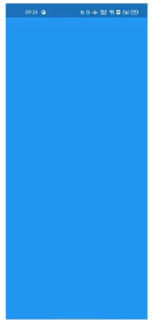
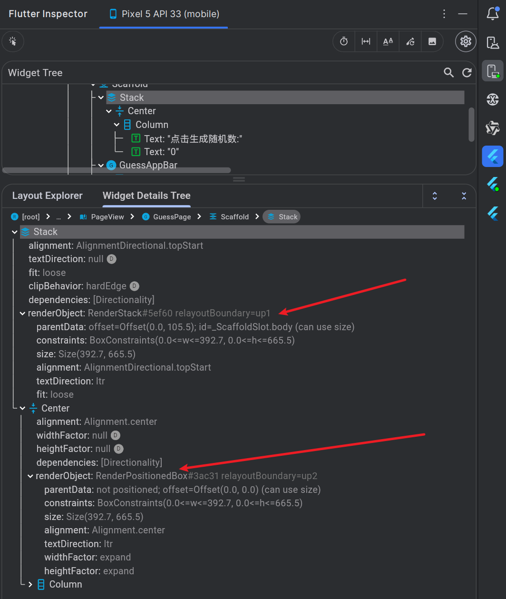
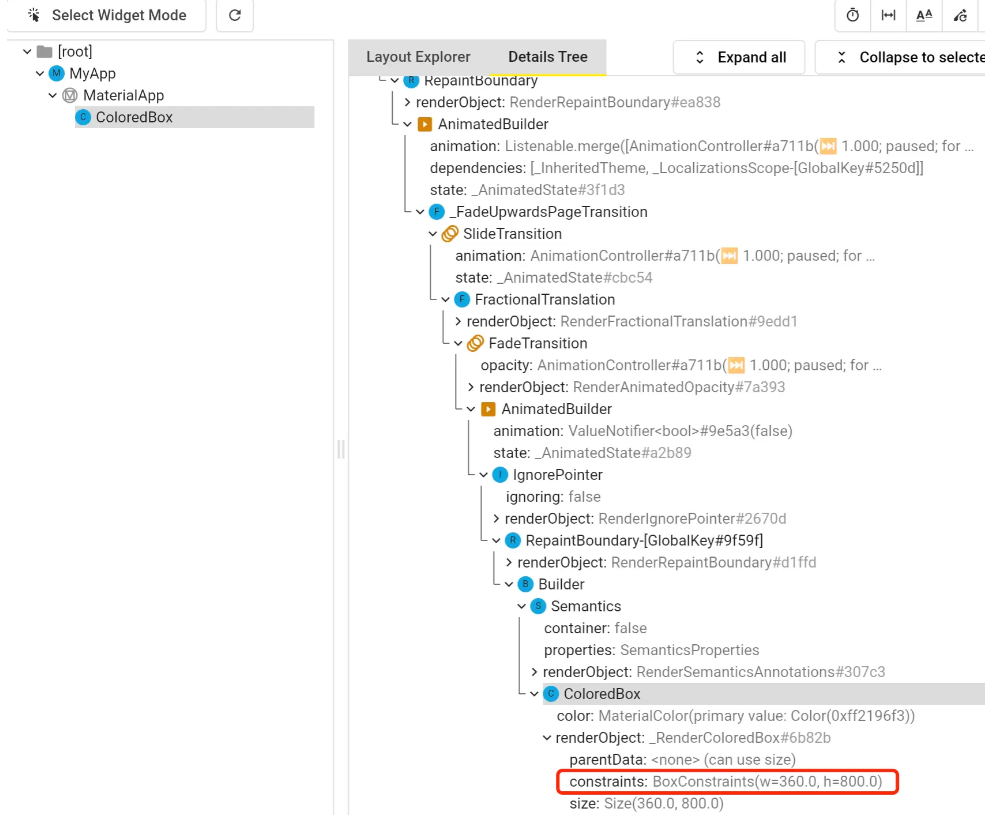
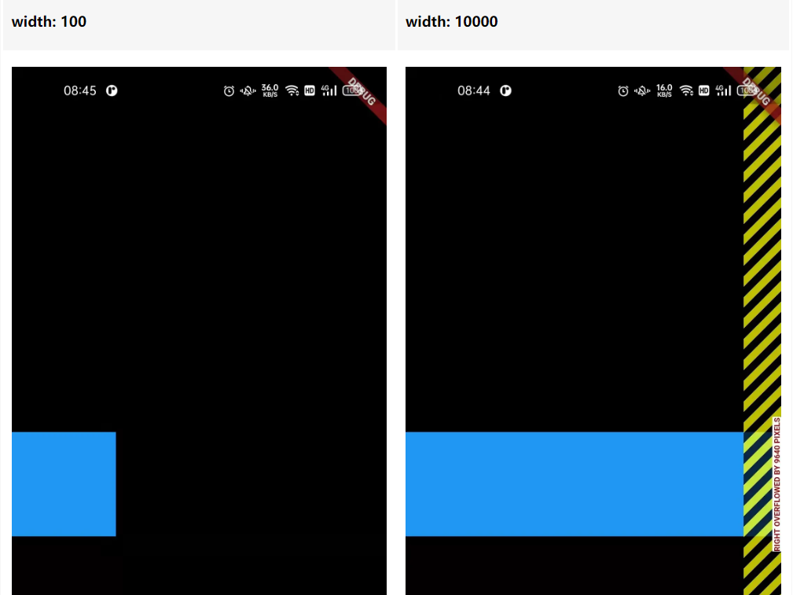
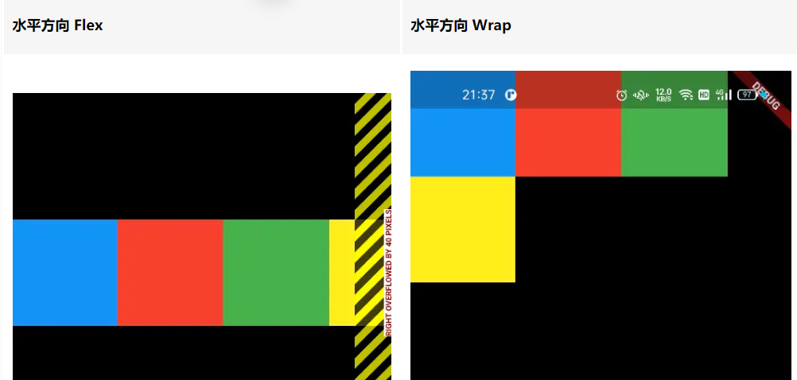
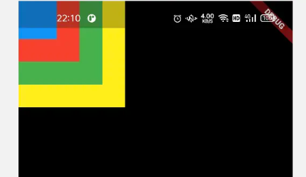
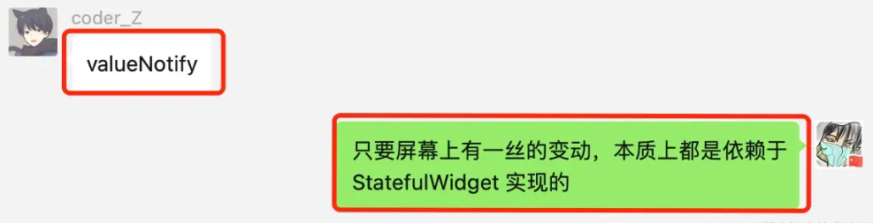

> Flutter的布局与HTML/CSS布局方式上的写法有很大的不同，Flutter使用基于组件树的布局模型，其中每个组件都有自己的布局和渲染逻辑。相比之下，HTML/CSS使用基于盒模型的布局，其中元素通过框模型和定位属性进行布局。


## 一、Widget

在Flutter中，一切皆是Widget。Widgets是Flutter用户界面的基本构建块，用于描述应用程序在给定其当前配置和状态的情况下应该如何显示。通过组合不同的Widget，我们可以构建出复杂、美观的用户界面。

Flutter中的Widget分为两类：

### 1. StatelessWidget

`StatelessWidget` 是抽象类，继承自 `Widget` 。本身的源码是非常简单的，其中只有一个 `build` 抽象方法用来构建组件，进行返回。也就是说，`StatelessWidget` 的派生类必须实现 `build` 方法，返回组件。

`StatelessWidget` 是不可变的，一旦创建就不能更改。它们通常用于表示那些没有状态改变的静态UI元素。例如，`Icon`、`Text`、`Container`等都是无状态的Widget。

```dart
class MyStatelessWidget extends StatelessWidget {
  @override
  Widget build(BuildContext context) {
    return Container(
      child: Text('Hello World'),
    );
  }
}
```

### 2. StatefulWidget

`StatefulWidget`是有状态的，可以根据应用程序的状态和用户交互来改变。当状态发生变化时，`StatefulWidget`会自动重绘 UI 。常见的有状态Widget包括按钮、输入框、列表等。

```dart
class MyStatefulWidget extends StatefulWidget {
  @override
  _MyStatefulWidgetState createState() => _MyStatefulWidgetState();
}

class _MyStatefulWidgetState extends State<MyStatefulWidget> {
  bool _isPressed = false;

  @override
  Widget build(BuildContext context) {
    return RaisedButton(
      onPressed: () {
        setState(() {
          _isPressed = !_isPressed;
        });
      },
      child: Text(_isPressed ? 'Pressed' : 'Not Pressed'),
    );
  }
}
```

`StatefulWidget` 继承自 `Widget` 的抽象类，其中定义了 `createState` 抽象方法，返回 `State` 对象。`State` 是一个抽象类，其中只有一个 `build` 抽象方法，返回 `Widget` 对象

对于 `Widget` 来说，有个约定：`所有组件的成员属性必须是不可变的` ，也就是说都需要通过 `final` 进行修饰。无论任何 `Widget` 的衍生类都是如此，即便是 `StatefulWidget` 一族组件 。`Flutter` 框架中 `Widget` 只作为对界面结构的配置描述，一旦一个 `Widget` 对象创建之后，就不允许对其成员属性进行任何修改。这本质上是 `final` 关键字的限制。

想要更新界面中文字的内容，唯一的方式就是给出新的配置信息，改变文字对象。又因为 `Widget` 派生类不允许修改任何成员，所以修改数据的过程就无法在 `Widget` 派生类中完成。这就是 `State` 类诞生的原由：我们需要有一处地方，可以修改数据，并触发重新构建界面的逻辑，实现界面更新。


> 口诀：约束向下传递，尺寸向上传递，位置由父组件决定。一切的布局效果，都可以通过约束去解释。

## 二、布局的重点-约束

### 1. 什么是约束

约束是 `Flutter` 布局的 `独有特性` ，也是对布局来说`最`为重要的概念。约束，就是`限制条件`。 那么`Flutter` 的约束 `限制的是什么` 。

`Flutter `中的约束通过 `Constraints` 类进行抽象，其中只有 `BoxConstraints` 和 `SliverConstraints` 两种实现类。 `SliverConstraints` 是在滑动中的约束，非滑动组件中的约束指的都是盒约束 `BoxConstraints`。

```dart
class BoxConstraints extends Constraints {
  /// Creates box constraints with the given constraints.
  const BoxConstraints({
    this.minWidth = 0.0,
    this.maxWidth = double.infinity,
    this.minHeight = 0.0,
    this.maxHeight = double.infinity,
  });
}
```

从上面 `BoxConstraints` 定义中可以看出，其本质就是维护 `宽高 `两个维度的 `范围`。`父级传递约束` 就是用来 `确定子级尺寸 `的，另外约束在布局中的一大特点是 `传递性`。

对与父子孙三级组件，子所 `受到的约束` 是由 `父` 传递的。该约束会用来确定 `子` 的尺寸，并且不同组件确定尺寸的逻辑不同，这个逻辑就是其布局的 `尺寸特性`。

同理，`子` 会也会传给 `孙` 一个约束，用于限制 `孙` 的尺寸，并且不同组件确定传递约束的逻辑不同，这个逻辑就是其布局的 `约束特性`。

`尺寸` 和 `约束` 是所有布局组件都会有的特性，至于偏移量，只有某些组件会有。比如 `Align` 、`Padding` 等，可以让子级相对于区域左上角产生偏移。

### 2. 紧约束

`紧约束` 一词来自于 `BoxConstraints` 类中的 `tight` 构造。通过 `BoxConstraints` 约束可以设置宽高的取值区间。在 `tight` 构造中，最小和最大宽都是 `size.width` ，最小和最大高都是 `size.height` 。在该约束下，被约束者的 `尺寸` 只有一种取值可能。

```dart
---->[BoxConstraints]----
/// Creates box constraints that is respected only by the given size.
BoxConstraints.tight(Size size)
  : minWidth = size.width,
    maxWidth = size.width,
    minHeight = size.height,
    maxHeight = size.height;
```

**简单的紧约束**，通过 `ColoredBox` 组件为默认区域进行着色：

```dart
void main() {
  runApp(const ColoredBox(color: Colors.blue));
}
```



在 `runApp` 方法中，展示的 `ColoredBox` 组件尺寸是 `屏幕尺寸`，从布局信息树中也可以看出： 此时 `ColoredBox` 对应的`渲染对象`尺寸是 `360*800` ，也就是屏幕尺寸。

### 3. 紧约束的尺寸锁死

通过 `SizedBox` 为 `ColoredBox` 指定 `100*100` 的尺寸会有什么效果：

```dart
void main() {
  runApp(
    const SizedBox(
      width: 100,
      height: 100,
      child: ColoredBox(color: Colors.blue),
    ),
  );
}
```

在父级是`紧约束`的条件下，`SizedBox` 无法对子级的尺寸进行修改。虽然 `SizedBox` 为子级施加了一个额外的 `BoxConstraints(w=100,h=100)` 紧约束，但 `ColoredBox` 的约束仍为 `BoxConstraints(w=360,h=800)` 。

### 4. 打破紧约束

#### 4.1. 解除约束：UnconstrainedBox

一个组件打破原有紧约束的方式：通过 `UnconstrainedBox` [解除约束]，让自身约束变为 [无约束]。

```dart
void main() {
  runApp(
    const UnconstrainedBox(
      child: ColoredBox(color: Colors.blue),
    ),
  );
}
```

屏幕全黑，因为 `ColoredBox` 的尺寸没有限制， `ColoredBox` 的尺寸特点是取约束的最小值，所以这里尺寸就是 `Size(0,0)` 。

另外注意一点： `UnconstrainedBox` 本身受到父级强约束限制，尺寸是 `Size(360,800)` 。

如何显示一个 `100*100` 的蓝色方块呢？现在只要使用 `SizedBox` 来添加一个强约束即可：

```dart
void main() {
  runApp(
    const UnconstrainedBox(
      child: SizedBox(
        width: 100,
        height: 100,
        child: ColoredBox(color: Colors.blue),
      ),
    ),
  );
}
```

#### 4.2. 通过布局组件放松约束

一个组件打破原有 [紧约束] 的方式：通过 `Align`、`Flex` 等组件 [放松约束]，让自身约束变为 [松约束]。

```dart
void main() {
  runApp(
    const Align(
      alignment: Alignment.topLeft,
      child: ColoredBox(color: Colors.blue),
    ),
  );
}
```

通过 `Align` 的参与，`ColoredBox` 的父级约束发生了变化，由原来的紧约束，变成了 `BoxConstraints(0.0<=w<=360.0,0.0<=h<=800.0)` 的宽松约束。此时它的尺寸仍为 `Size(0,0)` 。同理，我们可以在 `Align` 之下，通过 `SizedBox` 组件来为 `ColoredBox` 施加紧约束，从而达到设置尺寸的效果。

除了 `Align` 组件有放宽约束的能力之外，还有如 `Flex` 、 `Column`、`Row`、 `Wrap` 、`Stack` 等组件可以让父级的紧约束在一定程度上变得宽松。

#### 4.3. 自定义布局重新设置约束

通过 `CustomSingleChildLayout` 组件，自定义 `DiyLayoutDelegate` ，通过覆写 `getConstraintsForChild` 方法随意修改子级的约束。

```dart
void main() {
  runApp(
    CustomSingleChildLayout(
      delegate: DiyLayoutDelegate(),
      child: const ColoredBox(color: Colors.blue),
    ),
  );
}

class DiyLayoutDelegate extends SingleChildLayoutDelegate {
  
  @override
  bool shouldRelayout(covariant SingleChildLayoutDelegate oldDelegate) => false;

  @override
  BoxConstraints getConstraintsForChild(BoxConstraints constraints) {
    return BoxConstraints.tight(const Size(100, 100));// tag1
  }
}
```

`tag1` 处代码，将子级约束修改为 `100*100` 的紧约束

### 5. 盒约束的传递性

约束是父级渲染对象对子级渲染对象的尺寸限制。在子渲染对象布局时，父渲染对象会向子级传入约束信息。盒约束会随着渲染树自上而下进行传递，每个渲染节点都会根据自身的布局特点，对接收到的约束进行处理，然后继续向下传递。这就是 Flutter 布局体系构成的要素之一：`盒约束传递链`。


### 6. 查看约束：Flutter Inspector 面板

通过布局信息树，在组件的 `renderObject` 中可以看到渲染对象受到的盒约束。



### 7. 查看约束：LayoutBuilder 组件

在开发中，想要知道一块区域受到的盒约束。在代码中可以通过 `LayoutBuilder` 组件来获取父级渲染对象施加的约束。`LayoutBuilder` 组件提供一个 `builder` 回调方法来构建子组件，其中可以获取 `BoxConstraints` 对象，使用如下：

```dart
oid main() {
  runApp(
    const LayoutBuilder(builder: _buildByLayout),
  );
}

Widget _buildByLayout(BuildContext context, BoxConstraints constraints) {
  print(constraints);
  return // 构建子级组件
}

---->[打印日志]----
BoxConstraints(w=360.0, h=800.0)
```

注意：`LayoutBuilder` 只是让我们可以 `获取` 到父级施加的盒约束，它本身并不能对该约束进行任何处理，会原封不动的向子级传递。


## 三、常用组件施加的约束

### 1. MaterialApp

`MaterialApp` 作为开发中必备的组件 ，其本身是 `StatefulWidget` ，所以它的本质是若干组件的集合体。其中集成了非常多的组件，来实现应用的基础需求，主要包括：

- 集成 `AnimatedTheme` 、 `Theme` 、`Localizations` 组件处理应用主题和语言。
- 集成 `ScrollConfiguration` 、`Directionality`、 `PageStorage` 、`PrimaryScrollController` 、`MediaQuery` 等 `InheritedWidget` 组件为子级节点提供全局信息。
- 集成 `Navigator` 与 `Router` 组件处理路由跳转。
- 集成 `WidgetInspector` 、`PerformanceOverlay` 等调试信息组件。
- 集成 `Shortcuts` 与 `Actions` 等组件处理桌面端快捷键。

虽然 `MaterialApp` 组件集成了非常多的组件 ，但 `ColoredBox` 受到的约束仍为 `360*800` 的紧约束。也就是说，在渲染树中，从 `root` 节点开始依次向子级传递 `盒约束`，期间 `MaterialApp` 内含的众多渲染对象，都没有对约束的`大小`进行`修改`，其值是向下层层传递的。

在 `MaterialApp` 内的渲染对象们，在传递约束时可能生成新的约束对象，进行传递。



经典的布局问题：在 `MaterialApp` 的 `home` 中提供宽高为 `100` 的 `Container` 组件。

```dart
class MyApp extends StatelessWidget {
  @override
  Widget build(BuildContext context) {
    return MaterialApp(
      home: Container(
        color: Colors.blue,
        width: 100,
        height: 100,
      ),
    );
  }
}
```

尺寸无法生效，会填充全屏幕。

此时 `Container` 组件是由 `ConstrainedBox` 和 `ColoredBox` 组合成的组件。其中 `ConstrainedBox` 会额外施加一个 `BoxConstraints(w=100,h=100)` 的紧约束，但这个约束并没有对 `ColoredBox` 起作用。

### 2. Scaffold

在 `Container` 组件之上嵌套 `Scaffold` 组件，这时候 `Container` 组件中定义的宽高就生效了。

```dart
class MyApp extends StatelessWidget {
  const MyApp({Key? key}) : super(key: key);

  @override
  Widget build(BuildContext context) {
    return MaterialApp(
      home: Scaffold( // tag1 
        body: Container(
          color: Colors.blue,
          width: 100,
          height: 100,
        ),
      ),
    );
  }
}
```

此时 `Container` 组件中的 `ConstrainedBox` 组件受到的约束已经变成了松约束。表明 `Scaffold` 组件可以打破父级的 `紧约束`，为其下级提供一个`松约束`。在松约束下， `ConstrainedBox` 组件施加的紧约束就可以作用于 `ColoredBox` 组件，从而色块的区域为 `100*100` 。


**Scaffold 组件打破紧约束的本质**

`Scaffold` 组件并非是 `布局组件`。它继承自 `StatefulWidget` ，决定了它只是进行组合组件而已。 `Scaffold` 组件是一个组件集合体，本质上说是它内部的某个 `布局组件 `拥有打破紧约束的能力。将紧约束修改为宽松约束的组件是 `CustomMultiChildLayout` 。在本质上是通过 `CustomMultiChildLayout` 组件实现的 `多子组件` 自定义布局。

`Scaffold` 组件可以集成头部栏 `appBar`、底部栏 `bottomNavigationBar` 、左滑页 `drawer` 、右滑页 `endDrawer` 、底滑页 `bottomSheet` 、浮动按钮 `floatingActionButton` 、内容体 `body` 等。


### 3. Flex 组件

`Row` 本质上是 `direction: Axis.horizontal` 的 `Flex` 组件；`Column` 本质上是 `direction: vertical` 的 `Flex` 组件。所以 `Flex 组件` 的性质，也代指 `Row` 和 `Column` 组件的特性。

> 默认情况下，`Flex` 组件施加约束的特点：在 [主轴] 方向上 [无限约束]，在 [交叉轴] 方向上 [放松约束]。切Flex 的 children 列表中的组件，所受到的约束都是一致的。

`Flex` 在父级是紧约束的情况下，会为孩子提高相对宽松的约束。也就是说 `Flex` 内部可以在 `约束传递` 过程中修改约束。当 `Flex` 轴向为水平时 (即 `Row`)，不会限制孩子的宽度。，不过一旦超越父级尺寸，还是会有越界异常的。

> 越界只是 `debug` 模式下的提醒，在 `release` 模式中是不会出错的。

```dart
MaterialApp(
  home: Flex(
    direction: Axis.horizontal,
    children: [
      Container(
        color: Colors.blue,
        width: 100,
        height: 100,
      ),
    ],
  ),
)
```



### 4. Wrap 组件

`Flex` 组件的布局很 `执拗` ，不会 `“拐弯”` 。如下左图，四个 `100*100` 的色块，通过水平方向的 `Flex` 摆放，就会超出边界。而水平方向 `Wrap` 会自己拐弯，排不下会自动换行。`Wrap` 内限制了子组件的最大宽度是 `360.0` ，而不会限制高度。



默认情况下，`Wrap` 组件施加约束的特点：

- 在 **[主轴]** 方向上 **[放松约束]**，在 **[交叉轴]** 方向上 **[无限约束]**。
- Wrap 的 children 列表中的组件，所受到的约束都是一致的。

> 在前端 `css` 的 `flex` 布局中，是将 `wrap` 作为属性，成为 `flex` 布局的一个特性。在 `Flutter` 中将其拆分出来，作为两个布局组件。

### 5. Stack 组件

`Stack` 组件可以将多个组件进行叠放，效果如下：



在 `MaterialApp` 的紧约束下，`Stack` 组件是有打破紧约束的能力的。另外 `Stack` 组件中有一个 `fit` 属性，可以控制施加约束的类型，默认是 `StackFit.loose` ，提供宽松的约束。

```dart
Stack(
  fit: StackFit.expand,
  ...
)
```

还有 `fit: StackFit.passthrough` ， `Stack` 会将自身受到的约束原封不动的施加给子级。

`Stack` 组件施加约束的特点：

- loose 下,  宽高尽可能 [放松约束]。
- expand 下,  施加 [强约束]，约束尺寸为自身受到约束的 [最大尺寸]。
- passthrough 下,  仅 [传递约束]，把自身受到的约束原封不动的施加给子级。 
- Stack 的 children 列表中的组件，所受到的约束都是一致的。


## 四、其他布局组件

> 更多关于布局的内容，可以参考[Flutter布局指南open in new window](https://flutter.dev/docs/development/ui/layout)。

### 1. Container

Container是一个多功能的容器，可以用于装饰、定位和约束其子Widget。你可以设置它的大小、颜色、边距等。

```dart
Container(
  color: Colors.blue,
  width: 200,
  height: 200,
  child: Text('Hello'),
)
```

### 2. ListView

`ListView` 是一个滚动视图，可用于显示可滚动的列表。你可以使用`ListView.builder`或`ListView.separated`来构建列表。

```dart
ListView.builder(
  itemCount: 100,
  itemBuilder: (context, index) {
    return ListTile(
      title: Text('Item $index'),
    );
  },
)
```

### 3. Expanded

Expanded是一个灵活的布局组件，用于占据剩余可用空间。它通常与Row和Column一起使用。

指定 `Expanded`（`Flexible`、`Spacer`） 组件的 `flex` 属性，控制多个 `Expanded` 的宽度比例为 `1:2:3`。

```dart
Row(
  children: <Widget>[
    Expanded(
      flex: 1,
      child: Container(color: Colors.red),
    ),
    Expanded(
      flex: 2,
      child: Container(color: Colors.green),
    ),
  ],
)
```

`Expanded` 组件会为子级在主轴方向上施加 `紧约束` 。

### 4. Flexible

`Expanded` 继承自 `Flexible` , 也就是说 `Expanded` 等价于 `FlexFit.tight` 时的 `Flexible` 组件。

```dart
Expanded(child: ColoredBox(color: Colors.cyanAccent))
等价于：
Flexible( fit: FlexFit.tight, child: ColoredBox(color: Colors.cyanAccent))
```

`Flexible` 组件的 `fit` 属性类型为 `FlexFit` 枚举，有两个值 `tight`、`loose`，默认为 `loose` 。

- `FlexFit.tight` 会为子级在主轴方向上施加 `紧约束` ，且数值为剩余空间。
- `FlexFit.loose` 会为子级在主轴方向上施加 `松约束` ，最大值为剩余空间。

像微信的聊天信息，就是个最经典的 `FlexFit.loose` 的应用场景。当文字较少时，尺寸和文字宽度一致；当文字较多时，到达宽度约束上限会换行显示。



### 5. Spacer

`Spacer` 组件是一个 `空白占位` 组件。

`Spacer` 组件本质上就是对 `Expanded` 组件的简单封装。它的特点是不需要传入子组件，也就是说 `Spacer` 组件就是作为 `空白占位` 而存在的。

```dart
Row(
  children: <Widget>[
    Expanded(
      child: Container(color: Colors.red),
    ),
    const Spacer(),
    Expanded(
      child: Container(color: Colors.green),
    ),
  ],
)
```


