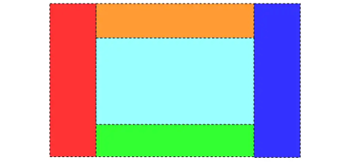
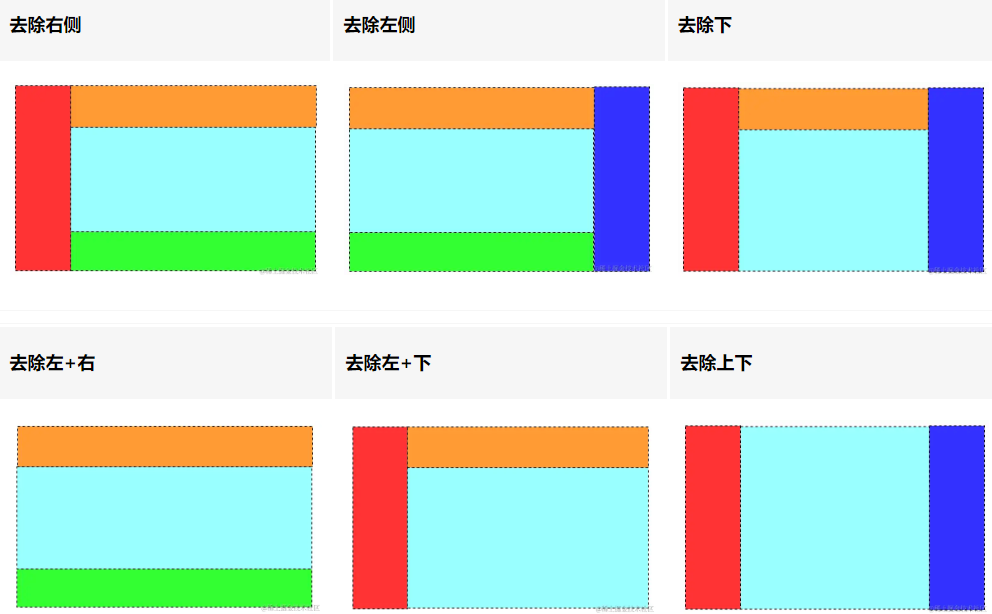
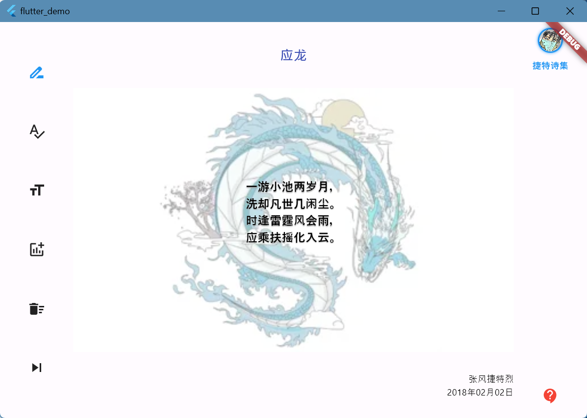
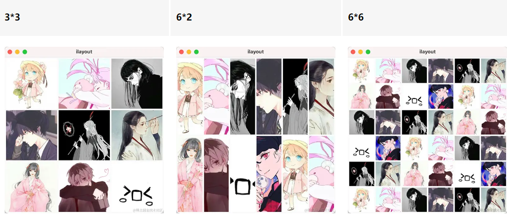

## 1. 回型结构

回型作为一个最基本的布局结构，如下，包括 `上` 、`下` 、`左` 、`右` 、`中` 五个部位。在这个布局的基础上，可以演化成其他布局。






**回型布局实现**

```dart
class LoopbackLayout extends StatelessWidget {
  const LoopbackLayout({super.key});

  @override
  Widget build(BuildContext context) {
    return Row(
      crossAxisAlignment: CrossAxisAlignment.stretch,
      children: [
        Expanded(flex: 1, child: Container(color: Colors.red)),
        Expanded(flex: 4, child: _buildCenter()),
        Expanded(flex: 1, child: Container(color: Colors.blue)),
      ],
    );
  }

  Widget _buildCenter() {
    return const Column(
      crossAxisAlignment: CrossAxisAlignment.stretch,
      children: [
        Expanded(flex: 1, child: ColoredBox(color: Colors.orange)),
        Expanded(flex: 4, child: ColoredBox(color: Colors.cyanAccent)),
        Expanded(flex: 1, child: ColoredBox(color: Colors.green)),
      ],
    );
  }
}
```


## 2. 回型布局应用



```dart
class DesktopHome extends StatelessWidget {
  const DesktopHome({super.key});

  @override
  Widget build(BuildContext context) {
    return Scaffold(
      body: Row(
        crossAxisAlignment: CrossAxisAlignment.stretch,
        children: [
          Expanded(flex: 1, child: buildLeft()),
          Expanded(flex: 6, child: _buildCenter()),
          Expanded(flex: 1, child: buildRight()),
        ],
      ),
    );
  }

  Widget buildLeft() => const Column(
        mainAxisAlignment: MainAxisAlignment.spaceEvenly,
        children: [
          Icon(Icons.drive_file_rename_outline, color: Colors.blue),
          Icon(Icons.spellcheck),
          Icon(Icons.format_size),
          Icon(Icons.addchart),
          Icon(Icons.delete_sweep),
          Icon(Icons.skip_next),
        ],
      );

  Widget _buildCenter() {
    return Column(
      crossAxisAlignment: CrossAxisAlignment.stretch,
      children: [
        Expanded(flex: 1, child: _buildTop()),
        Expanded(flex: 4, child: _buildCenterPanel()),
        Expanded(flex: 1, child: _buildFoot()),
      ],
    );
  }

  Widget buildRight() => Align(
        alignment: Alignment.topCenter,
        child: Column(
          children: [
            Padding(
              padding: const EdgeInsets.only(top: 8.0, bottom: 8.0),
              child: Container(
                width: 34,
                height: 34,
                padding: const EdgeInsets.all(2),
                decoration: const BoxDecoration(
                  color: Colors.blue,
                  shape: BoxShape.circle,
                  boxShadow: [BoxShadow(blurRadius: 3, color: Colors.blue)],
                ),
                child: const Image(
                  image: AssetImage('assets/images/icon_head.webp'),
                ),
              ),
            ),
            const Text(
              '捷特诗集',
              style: TextStyle(
                color: Colors.blue,
                fontSize: 12,
                fontWeight: FontWeight.bold,
              ),
            ),
            const Spacer(),
            const Padding(
              padding: EdgeInsets.symmetric(vertical: 18.0),
              child: Icon(Icons.contact_support, color: Colors.red),
            ),
          ],
        ),
      );

  Widget _buildTop() {
    return const Center(
      child: Text(
        '应龙',
        style: TextStyle(
          color: Colors.indigo,
          fontSize: 18,
          fontWeight: FontWeight.bold,
        ),
      ),
    );
  }

  Widget _buildCenterPanel() {
    return const DecoratedBox(
      decoration: BoxDecoration(
        color: Colors.white,
        image: DecorationImage(
          opacity: 0.5,
          image: AssetImage('assets/images/dragon.webp'),
          fit: BoxFit.fitHeight,
        ),
      ),
      child: Center(
        child: Text(
          """
一游小池两岁月，
洗却凡世几闲尘。
时逢雷霆风会雨，
应乘扶摇化入云。
        """,
          style: TextStyle(
            fontSize: 16,
            shadows: [
              Shadow(color: Colors.grey, blurRadius: 1, offset: Offset(0, 1))
            ],
            color: Colors.black,
            fontWeight: FontWeight.bold,
          ),
        ),
      ),
    );
  }

  Widget _buildFoot() {
    TextStyle style = const TextStyle(fontSize: 12, color: Colors.black);
    return Column(
      mainAxisAlignment: MainAxisAlignment.center,
      crossAxisAlignment: CrossAxisAlignment.end,
      children: [
        Text('张风捷特烈', style: style),
        Text('2018年02月02日', style: style)
      ],
    );
  }
}

```


## 3. NXM 等分结构

`n*m` 的布局结构，只要指定行列数，就可以对一个区域进行等分分割。



```dart
class NXMLayout extends StatelessWidget {
  const NXMLayout({super.key});

  @override
  Widget build(BuildContext context) {
    return Scaffold(body: GridLayout(n: 3, m: 3));
  }
}

class GridLayout extends StatelessWidget {
  final int n; // 行数
  final int m; // 列数
  GridLayout({super.key, required this.n, required this.m});

  @override
  Widget build(BuildContext context) {
    List<Widget> children = [];
    for (int i = 0; i < n; i++) {
      List<Widget> columnChildren = [];
      for (int j = 0; j < m; j++) {
        columnChildren.add(
          Expanded(child: ColoredBox(color: randomColor())),
        );
      }
      children.add(
        Expanded(
          child: Column(
            crossAxisAlignment: CrossAxisAlignment.stretch,
            children: columnChildren,
          ),
        ),
      );
    }
    return Row(
      crossAxisAlignment: CrossAxisAlignment.stretch,
      children: children,
    );
  }

  final Random random = Random();

  Color randomColor({
    int limitA = 120,
    int limitR = 0,
    int limitG = 0,
    int limitB = 0,
  }) {
    int a = limitA + random.nextInt(256 - limitA); //透明度值
    int r = limitR + random.nextInt(256 - limitR); //红值
    int g = limitG + random.nextInt(256 - limitG); //绿值
    int b = limitB + random.nextInt(256 - limitB); //蓝值
    return Color.fromARGB(a, r, g, b); //生成argb模式的颜色
  }
}
```


