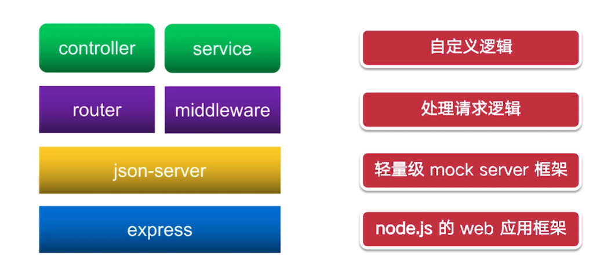

# 1. json-server

## 1.1 简介

`json-server` 是一款小巧的接口模拟工具，一分钟内就能搭建一套 Restful 风格的 API，尤其适合前端接口测试使用。

**使用方式：**

- 方式一：通过json-server命令启动一个服务
- 方式二：通过module将json-server引入到自己的node服务中

## 1.2 方式二

### 1.2.1 架构

